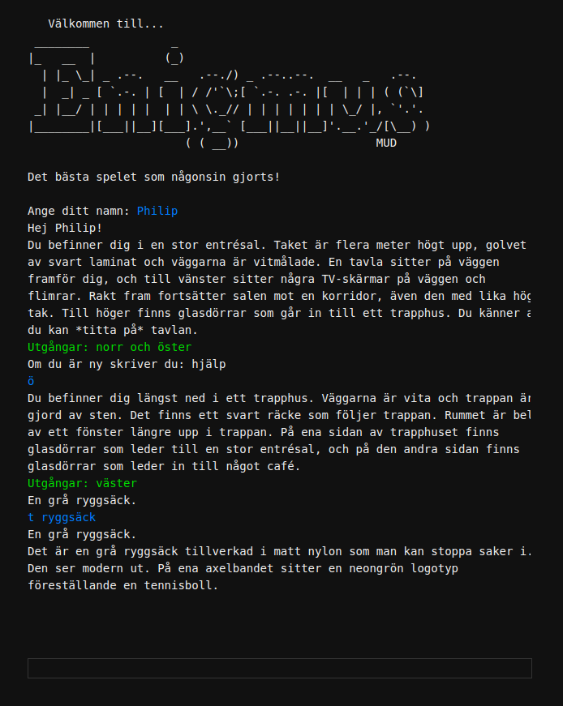

# Enigmus MUD

Enigmus is a simple [MUD](https://en.wikipedia.org/wiki/MUD) (multiplayer text game, kind of) game engine. As a kid, I used to play [Genesis MUD](https://www.genesismud.org/). Inspired by my memories of it, its awesomeness and an eagerness to learn the [Python](https://www.python.org/) programming language, I decided to create Enigmus.

I've written a couple of quests to provide a testing environment (the HB quest tells the story of the University of Borås—what an awesome opportunity to work on my creative writing skills!) and give examples of how the engine can be used. Notice the architecture of the engine - how extendable it is with scripts, how rooms are stored in text files etc.

The game is entirely in Swedish, although this is quest-dependent and, of course, quests could just as well be written in English or any other language!

